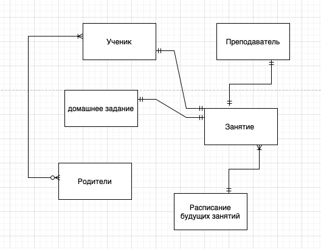
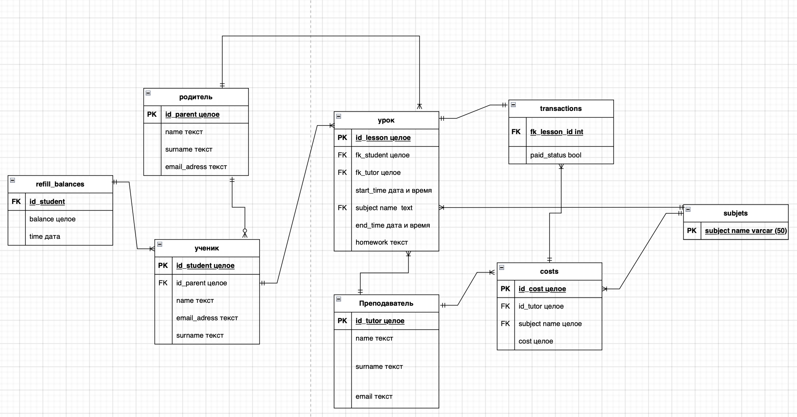

# database_project by Filippov Denis

## концептуальная модель проекта:
Проект предсавляет собой базу данных для проведения занятий в онлайн школе. У каждого ученика есть свой баланс и у каждого преподавателя есть своя стоимость уроков.
Таблица с уроками включает в себя информацию о том, когда урок и его учасниками. Таблица с балансами реализована, как баланс и время, когда он стал таким (таблица с версионными данными).




## Таблица 1: Таблица "parents"
| Название поля | Тип данных | Ограничения |
|---------------|------------|-------------|
| id_parent     | BIGSERIAL  | NOT NULL, PRIMARY KEY |
| name          | VARCHAR(50)| NOT NULL    |
| surname       | VARCHAR(50)| NOT NULL    |
| email_adress  | VARCHAR(50)| NOT NULL    |

##Таблица 2: Таблица "students"
| Название поля | Тип данных | Ограничения |
|---------------|------------|-------------|
| id            | BIGSERIAL  | NOT NULL, PRIMARY KEY |
| id_parent     | BIGINT     | REFERENCES parents(id_parent) |
| name          | VARCHAR(50)| NOT NULL    |
| surname       | VARCHAR(50)| NOT NULL    |
| email_adress  | VARCHAR(50)| NOT NULL    |

 ##Таблица 3: Таблица "refill_balances"
 | Название поля | Тип данных | Ограничения |
|---------------|------------|-------------|
| student_id    | BIGINT     | REFERENCES students(id) |
| balance       | integer    | DEFAULT 0   |
| time_change   | timestamp  | NOT NULL    |

## Таблица 4: Таблица "subjects"
| Название поля | Тип данных | Ограничения |
|---------------|------------|-------------|
| subject_name  | VARCHAR(50)| NOT NULL, PRIMARY KEY |
## Таблица 5: Таблица "tutors"
| Название поля | Тип данных | Ограничения |
|---------------|------------|-------------|
| id            | BIGSERIAL  | NOT NULL, PRIMARY KEY |
| name          | VARCHAR(50)| NOT NULL    |
| surname       | VARCHAR(50)| NOT NULL    |
| email_adress  | VARCHAR(50)| NOT NULL    |

## Таблица 6: Таблица "cost"
| Название поля | Тип данных | Ограничения |
|---------------|------------|-------------|
| id            | BIGSERIAL  | NOT NULL, PRIMARY KEY |
| id_tutor      | INTEGER    | REFERENCES tutors(id) |
| subject       | VARCHAR(50)| REFERENCES subjects(subject_name) |
| cost          | integer    | NOT NULL    |


## Таблица 7: Таблица "lessons"

| Название поля | Тип данных | Ограничения |
|---------------|------------|-------------|
| id            | SERIAL     | PRIMARY KEY |
| fk_student    | BIGINT     | REFERENCES students(id) |
| fk_tutor      | BIGINT     | REFERENCES tutors(id) |
| start_time    | timestamp  | NOT NULL, CHECK (end_time > start_time) |
| end_time      | timestamp  | NOT NULL, CHECK (end_time > start_time) |
| subject       | VARCHAR(50)| REFERENCES subjects(subject_name) |
| homework      | TEXT       |             |

##Таблица 8: Таблица "transactions"
| Название поля | Тип данных | Ограничения |
|---------------|------------|-------------|
| fk_lesson     | INTEGER    | REFERENCES lessons(id) |
| paid_status   | BOOLEAN    |             |


## Описание таблиц базы данных

1. **Таблица "parents"**:
   - Содержит информацию о родителях.
   - Колонки:
     - `id_parent`: Уникальный идентификатор родителя (первичный ключ).
     - `name`: Имя родителя.
     - `surname`: Фамилия родителя.
     - `email_adress`: Адрес электронной почты родителя.

2. **Таблица "students"**:
   - Содержит информацию о студентах.
   - Колонки:
     - `id`: Уникальный идентификатор студента (первичный ключ).
     - `id_parent`: Идентификатор родителя, на которого ссылается студент (внешний ключ).
     - `name`: Имя студента.
     - `surname`: Фамилия студента.
     - `email_adress`: Адрес электронной почты студента.

3. **Таблица "refill_balances"**:
   - Содержит информацию о пополнении баланса студентов.
   - Колонки:
     - `student_id`: Идентификатор студента, на которого ссылается пополнение баланса (внешний ключ).
     - `balance`: Текущий баланс.
     - `time_change`: Время изменения баланса.

4. **Таблица "subjects"**:
   - Содержит информацию о предметах.
   - Колонки:
     - `subject_name`: Название предмета (первичный ключ).

5. **Таблица "tutors"**:
   - Содержит информацию о преподавателях.
   - Колонки:
     - `id`: Уникальный идентификатор преподавателя (первичный ключ).
     - `name`: Имя преподавателя.
     - `surname`: Фамилия преподавателя.
     - `email_adress`: Адрес электронной почты преподавателя.

6. **Таблица "cost"**:
   - Содержит информацию о стоимости занятий.
   - Колонки:
     - `id`: Уникальный идентификатор записи о стоимости (первичный ключ).
     - `id_tutor`: Идентификатор преподавателя, на которого ссылается стоимость (внешний ключ).
     - `subject`: Название предмета, на который ссылается стоимость (внешний ключ).
     - `cost`: Стоимость занятия.

7. **Таблица "lessons"**:
   - Содержит информацию о проведенных уроках.
   - Колонки:
     - `id`: Уникальный идентификатор урока (первичный ключ).
     - `fk_student`: Идентификатор студента, на которого ссылается урок (внешний ключ).
     - `fk_tutor`: Идентификатор преподавателя, на которого ссылается урок (внешний ключ).
     - `start_time`: Время начала урока.
     - `end_time`: Время окончания урока.
     - `subject`: Название предмета урока.
     - `homework`: Домашнее задание.

8. **Таблица "transactions"**:
   - Содержит информацию о транзакциях (оплате) за уроки.
   - Колонки:
     - `fk_lesson`: Идентификатор урока, на который ссылается транзакция (внешний ключ).
     - `paid_status`: Статус оплаты (TRUE - оплачено, FALSE - не оплачено).


# Дополнительные задачи 

1. **Создание представлений**:
Представление для таблицы "students" и "parents"  
```CREATE VIEW student_parent_view AS
SELECT s.id, s.name AS student_name, s.surname AS student_surname,
       s.email_adress AS student_email, p.name AS parent_name, 
       p.surname AS parent_surname, p.email_adress AS parent_email
FROM students s
JOIN parents p ON s.id_parent = p.id_parent;
```
2. **Создание индексов**:
Индекс для таблицы "students" 
```CREATE INDEX idx_students_id_parent ON students (id_parent);
```

3. **Создание хранимых процедур или функций**:
Процедура для добавления урока
```CREATE OR REPLACE PROCEDURE add_lesson(
    in_student_id BIGINT,
    in_tutor_id BIGINT,
    in_start_time TIMESTAMP,
    in_end_time TIMESTAMP,
    in_subject VARCHAR(50),
    in_homework TEXT)
AS
$$
BEGIN
    INSERT INTO lessons (fk_student, fk_tutor, start_time, end_time, subject, homework)
    VALUES (in_student_id, in_tutor_id, in_start_time, in_end_time, in_subject, in_homework);
END;
$$
LANGUAGE plpgsql;

```
Функция для расчета общего баланса студента
```
CREATE OR REPLACE FUNCTION calculate_total_balance(student_id BIGINT)
RETURNS INTEGER AS
$$
DECLARE
    total_balance INTEGER;
BEGIN
    SELECT SUM(balance) INTO total_balance
    FROM refill_balances
    WHERE student_id = $1;

    RETURN total_balance;
END;
$$
LANGUAGE plpgsql;
```
Процедура для обновления баланса студента после пополнения
```
CREATE OR REPLACE PROCEDURE update_balance(
    in_student_id BIGINT,
    in_amount INTEGER)
AS
$$
BEGIN
    UPDATE refill_balances
    SET balance = balance + in_amount
    WHERE student_id = in_student_id;
END;
$$
LANGUAGE plpgsql;
```
4. **Создание триггеров**:

Триггер для автоматического обновления баланса при пополнении

```
CREATE OR REPLACE FUNCTION update_student_balance()
RETURNS TRIGGER AS
$$
BEGIN
    UPDATE refill_balances
    SET balance = balance + NEW.amount
    WHERE student_id = NEW.student_id;

    RETURN NEW;
END;
$$
LANGUAGE plpgsql;

CREATE TRIGGER update_student_balance_trigger
AFTER INSERT ON refill_balances
FOR EACH ROW
EXECUTE FUNCTION update_student_balance();
```
Триггер для проверки времени начала и конца урока
```
CREATE OR REPLACE FUNCTION validate_lesson_time()
RETURNS TRIGGER AS
$$
BEGIN
    IF NEW.end_time <= NEW.start_time THEN
        RAISE EXCEPTION 'End time must be greater than start time';
    END IF;

    RETURN NEW;
END;
$$
LANGUAGE plpgsql;

CREATE TRIGGER validate_lesson_time_trigger
BEFORE INSERT ON lessons
FOR EACH ROW
EXECUTE FUNCTION validate_lesson_time();
```
Триггер для автоматического выставления статуса "оплачено" при проведении урока
```
CREATE OR REPLACE FUNCTION update_transaction_status()
RETURNS TRIGGER AS
$$
BEGIN
    INSERT INTO transactions (fk_lesson, paid_status)
    VALUES (NEW.id, TRUE);

    RETURN NEW;
END;
$$
LANGUAGE plpgsql;

CREATE TRIGGER update_transaction_status_trigger
AFTER INSERT ON lessons
FOR EACH ROW
EXECUTE FUNCTION update_transaction_status();
```

5. **Создание тестов с использованием pytest**:
Создание тестов с использованием pytest  
тест для проверки добавления урока  
тест для проверки общего баланса студента  
тест для проверки времени начала и конца урока  
тест для проверки автоматического обновления баланса при пополнении

6. **Генерация данных и анализ**:
